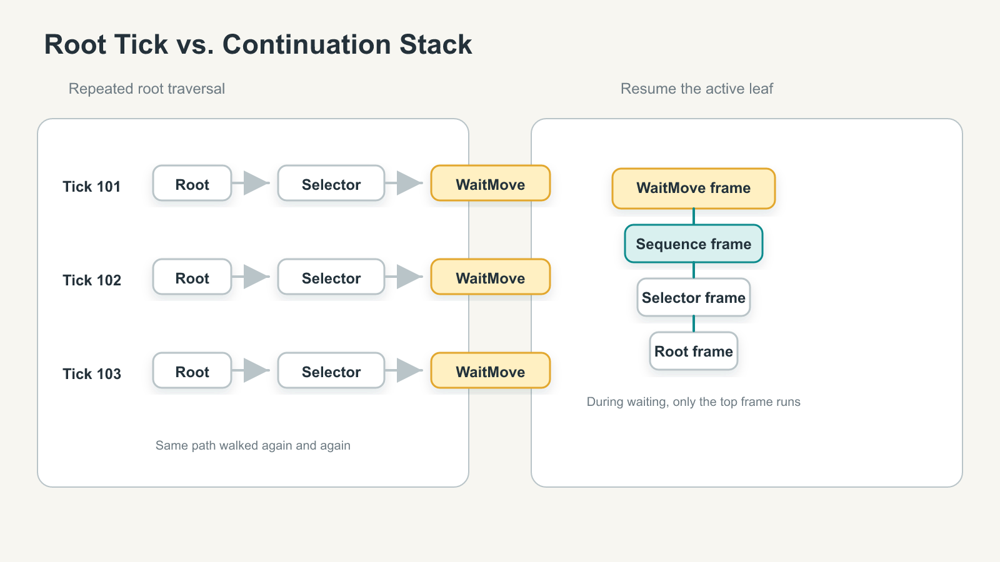
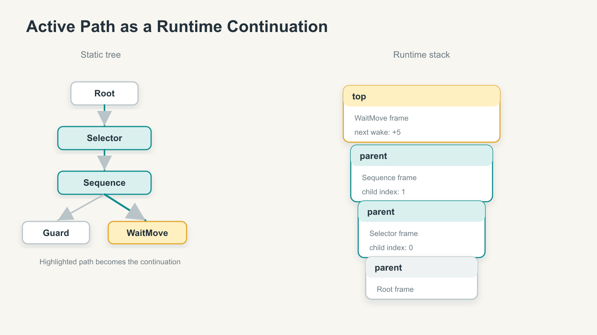
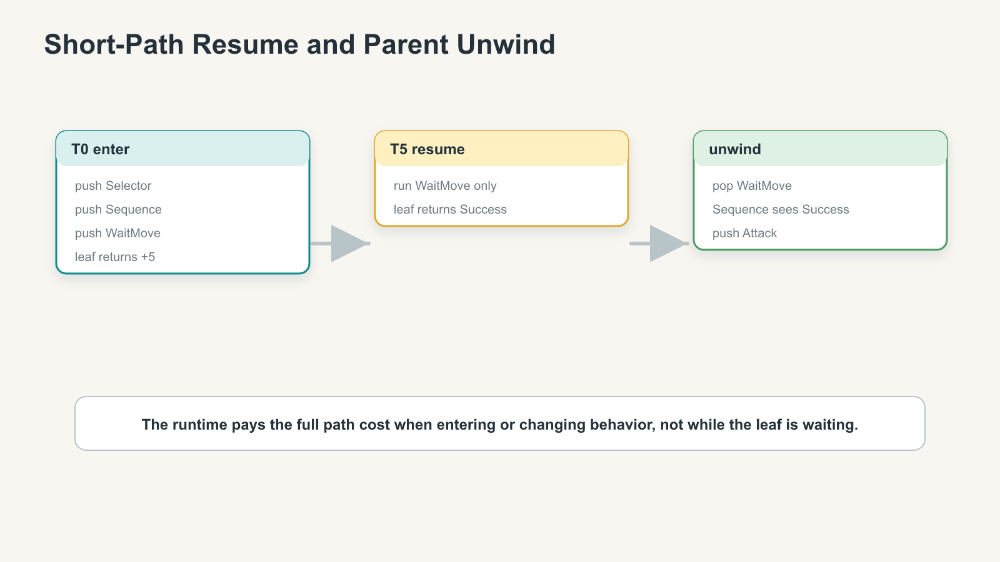
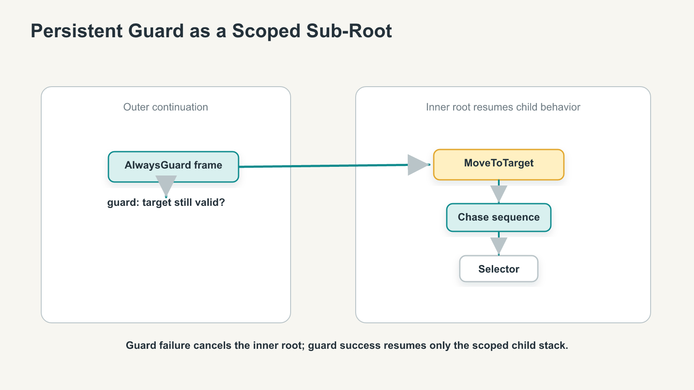
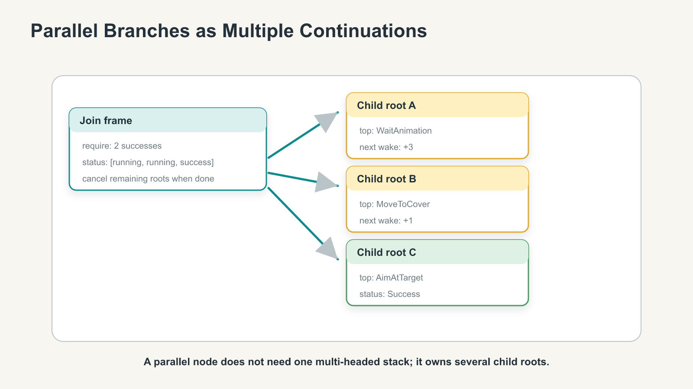
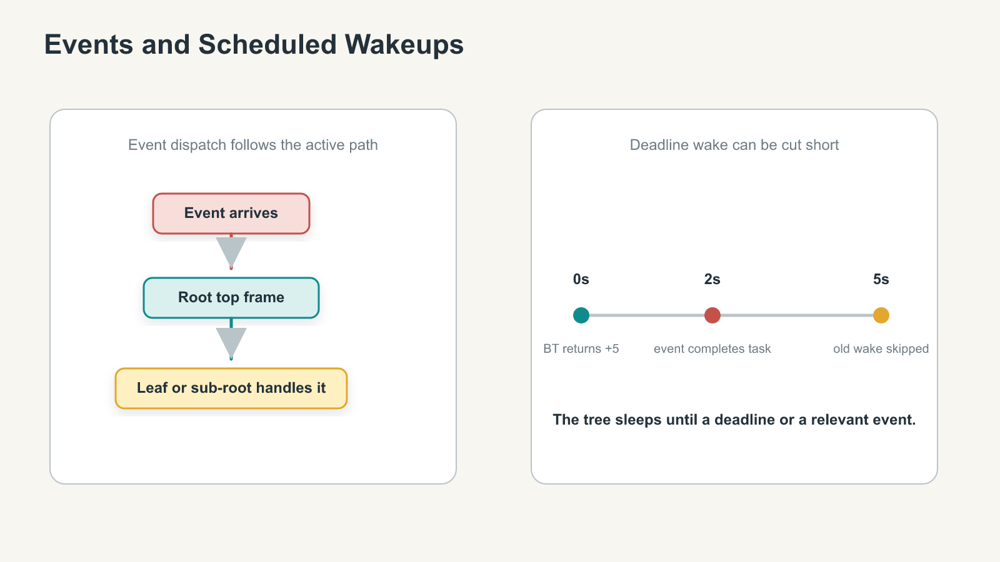
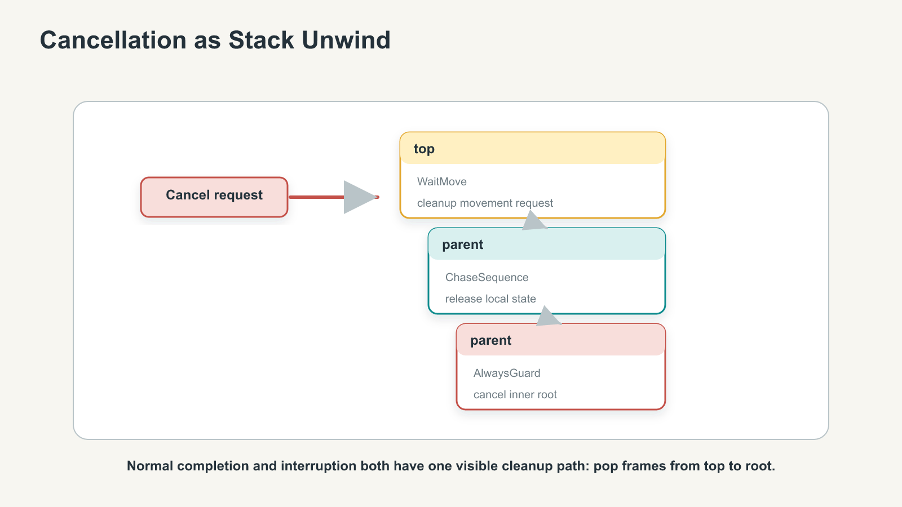

# A Stack-First Behavior Tree Runtime for Server-Side Game AI

What if a behavior tree could sleep on its current leaf instead of walking down from the root every update?


For the past few months I have been experimenting with small server-side runtime pieces for game AI. One of those pieces is a behavior-tree package written in Go. It started with a familiar frustration: on a game server, many NPCs are not really *thinking* most of the time. They are waiting.

They are waiting for movement to reach a point, an attack wind-up to finish, a cooldown to expire, a pathfinding request to return, an animation event to fire, or a target to move back into range. A shard can have thousands of those agents. Their trees may be interesting when they choose a new behavior, but during the waiting part the runtime often does a lot of work just to arrive at the same running action again.

This article is a breakdown of one runtime design I found useful: make the active behavior-tree path an explicit continuation stack.

The point is not to invent new behavior-tree semantics. Mature BT systems already have running actions, memory composites, asynchronous nodes, halting, and reactive decorators. The point is narrower and more practical: if the current execution path is stored as a first-class runtime object, then the server can resume long-running behavior from the leaf, route events to the active task, cancel work by unwinding the stack, and let the tree tell an external scheduler when it actually needs to wake up.

## The Root-Tick Mental Model

The common mental model for behavior trees is wonderfully simple: tick the root, let composites choose children, run guards and decorators, and eventually reach an action. If the action returns `Running`, the tree will be ticked again next update.

Many implementations improve on the naive version. A memory sequence can remember which child was running. An async action can continue outside the tick. A reactive sequence can re-check important conditions. Those are all real tools, and they matter.

For the server workload I cared about, though, the question was slightly different: does the runtime treat the active execution path as one object, or is that path scattered across node-local memory and reconstructed through a root tick?



Imagine a tree that reaches `WaitMove`. On tick 101 it walks through `Root -> Selector -> Sequence -> WaitMove`. On tick 102 it walks through a similar path again. On tick 103 it does it again. If the NPC is just waiting for movement completion, the repeated selector and sequence work is not where the interesting decision is happening.

The structural alternative is to store the path that got us there.

## Active Path as a Continuation

In this runtime, the static tree definition and the runtime execution frames are different objects.

The static tree is made of nodes. A node says, "I am a sequence," or "I am a task," or "I am a persistent guard." It is configuration.

The runtime stack is made of frames. A frame says, "I am currently executing this sequence, I already finished child 0, and my parent frame is over there." It is continuation state.

The conceptual shape is small:

```go
type Root struct { top Task }

type Task interface {
    Execute(from Status) Status
    OnComplete(cancel bool)
}
```

The real Go implementation is generic and carries a context type and event type, but this is the important part: `Root` only needs to know the top frame. Each frame knows its parent. When the top frame finishes, the runtime pops it and passes its result back to the parent frame.



The first time the tree enters a branch, it pays the normal traversal cost. The root frame pushes a selector frame, the selector pushes a sequence frame, and the sequence pushes the leaf task. If that leaf returns a running status, the runtime stops there. The next update does not need to begin at the root. It resumes the top frame.

This is just an explicit version of what recursive evaluation does implicitly, except the continuation survives after the function call would normally return.

## Resuming From the Leaf

The execution loop has three important cases.

First, a frame can push a child. In the implementation I use, that is represented by a neutral internal status meaning "a new child was pushed; keep executing the new top." This is how composite and decorator frames descend into the tree without recursive calls.

Second, a frame can return a positive status. Positive means the task is still running, and the value is a relative wakeup hint. If `WaitMove` returns `+5`, the tree is saying, "I am still running; if nothing else happens, ask me again in five time units."

Third, a frame can finish with success or failure. The runtime pops it, calls completion cleanup, and feeds that result to the parent frame. The parent may finish, revise the result, repeat the child, or push a sibling.



That is the main performance intuition. The runtime still pays for decisions when decisions are needed. It only avoids reinterpreting a stable path while the leaf is waiting.

## Composites and Decorators Are Frames

The first worry with an explicit stack is usually, "Does this only work for a trivial sequence with one running leaf?"

It does not have to. Ordinary composites map cleanly to frames.

A sequence frame stores a child index and maybe a success count. On first entry it pushes child 0. When that child returns, the sequence frame receives the child status, updates its local counters, and either returns a final status or pushes the next child.

A selector frame looks almost the same. It just interprets child success and failure differently.

Decorators also become frames. A result-revising decorator pushes its child on first entry. When the child returns, the decorator maps the result. A repeat decorator stores a loop count and success count, then pushes the same child again until its requirement is met or its maximum loop count is exhausted.

This is the part of the design that should feel unsurprising. A composite already has local execution state. The stack frame simply makes that state explicit and gives it a parent pointer.

## Persistent Guards as Scoped Sub-Roots

The more interesting problem is reactive behavior.

Some guards are not "check once before entering." If an NPC is chasing a target, "target is still valid" may need to be checked every update or every event while the chase subtree is running. A root-tick runtime can get this behavior by passing through the guard again. If we resume directly from the leaf, we need another shape.

The shape I use is a scoped sub-root.

In the outer continuation, `AlwaysGuard` behaves like a running leaf. Internally, however, it owns another `Root` for its child subtree. Every time the outer runtime resumes the guard frame, the guard is checked first. If the guard passes, the inner root resumes the child path. If the guard fails, the inner root is cancelled and the guard frame returns failure.



This is not the same thing as a global observer-abort system. It is a scoped reactive model. The designer or gameplay programmer must choose the region that needs persistent checking and wrap that region in a persistent guard.

I like that tradeoff for server AI because it is explicit. A high-priority condition is not magically watching the entire tree. The runtime says exactly which subtree is protected by the guard, and cancellation has a clear boundary.

## Parallel Branches as Multiple Continuations

Parallel behavior is another place where a single stack can sound too restrictive. If a node runs three children at once, does the stack need three heads?

The answer in this runtime is no. The outer continuation still has one top frame: the join frame. That frame owns several child roots, one per parallel branch.

Each child root has its own continuation stack. The join frame executes the child roots that are still running, tracks their statuses, and counts completions. When its requirement is satisfied, it cancels the branches that are still running and returns success. If all branches finish without satisfying the requirement, it returns failure.



This is the same idea as the persistent guard, just with several scoped roots instead of one. A complex BT feature becomes composition of continuations, not a special multi-headed global stack.

One small engineering detail mattered here. If an event is forwarded into a parallel node and only one child consumes it, the join frame still has to compute the next wakeup across all running children, including children that did not handle that event. Otherwise the scheduler might delay a branch that was already due sooner. This was a real bug in my first version, and the fix made the runtime model clearer: after a consumed event, the join frame owns the aggregate wakeup for all still-running child roots.

## Events and Scheduled Wakeups

Server-side AI should not always wait for the next global tick. Many waiting tasks have better wakeup sources.

A movement task can wake when pathfinding completes. A wind-up can wake on an animation event. A cooldown wait can wake on its deadline unless a cooldown-reset event arrives first. A target wait can wake when perception says the target is visible again.

In this runtime, events are sent to the active continuation. `Root.OnEvent` asks the top frame whether it can handle the event. A normal leaf may consume it directly. A persistent guard can re-check its guard and forward the event to its inner root. A join frame can forward the event to its child roots and then recompute the aggregate status.



The status encoding is intentionally compact:

| Status value | Meaning |
|--------------|---------|
| `> 0` | still running; value is a relative delay hint |
| `0` | internal "new child" marker, or event was not handled |
| `-1` | success |
| `<= -2` | failure |

That compactness is not free. `0` carries two meanings depending on whether it is used inside execution or event dispatch. A production-facing API could split those concepts into separate types. For the small runtime I was building, the compact encoding made it easy to connect behavior-tree execution to an external scheduler.

The important design point is not the exact integer layout. It is that a running action can tell the server when it wants to be updated again, and an event can cut that wait short.

## Cancellation as Stack Unwind

Cancellation is where explicit continuations become especially useful.

Game AI cancels work all the time. A guard fails. A parallel branch reaches its requirement and no longer needs the other branches. An NPC dies. A root is shut down because the entity is despawned. If tasks allocate resources, submit requests, or subscribe to events, cancellation must be a first-class path.

With an explicit stack, cancellation is not a side channel. It is stack unwind.

The root pops the top frame, calls `OnComplete(cancel=true)`, moves to the parent, and repeats. A persistent guard cancels its inner root. A join frame cancels any still-running child roots. Normal completion and interrupted completion use the same visible cleanup hook, with the `cancel` flag distinguishing the reason.



This also improves debugging. When something is cancelled, the runtime has a concrete path to report: `WaitMove -> ChaseSequence -> AlwaysGuard`, for example. That path is more useful than "the tree was halted" because it names the active continuation that was interrupted.

## What This Does Not Claim

There are a few boundaries worth stating clearly.

First, an explicit traversal stack is not a brand-new idea. Data-oriented behavior-tree discussions have talked about traversal stacks before, and many behavior-tree engines contain equivalent state in some form. The claim here is not "nobody has used a stack." The claim is that making the continuation stack the center of the runtime gives a clean way to explain guards, parallel children, events, wakeups, and cancellation together.

Second, this is not a full replacement for global reactive behavior trees. If you want high-priority observers that can abort from anywhere, you still need to model that system. In this runtime, the local tool is the scoped persistent guard. That is deliberate, but it is not universal.

Third, this is not yet a benchmark article. Structurally, the runtime avoids repeated path traversal while a leaf is waiting. The current Go implementation still has obvious optimization work to do, especially around frame allocation and small helper calls that may not inline through generics. Before turning this into a performance claim, I would measure a deep running leaf against a root-tick baseline and a memory-composite baseline, then separately measure event wakeup latency and parallel wake aggregation.

Finally, deterministic games need deterministic randomness. The experimental stochastic branch currently uses a global random source. For replay, lockstep, or strict server reproducibility, the random stream should be injected through context or node configuration.

## Takeaways

If you are building or revisiting a behavior-tree runtime for server-side AI, these are the three ideas I would keep:

1. Treat the active BT path as a continuation, not as hidden recursion.
2. Model advanced BT features as stack frames or scoped sub-roots.
3. Let running tasks report their next wakeup, and let events cut that wait short.

The design is not tied to Go. The useful part is the representation. A behavior tree does not have to be interpreted from the root every update. If the runtime keeps the current path as an explicit continuation, long-running behavior can sleep exactly where it is, and the rest of the system can wake it only when there is something worth doing.
